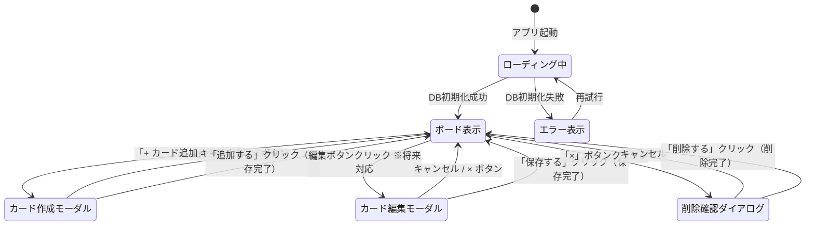

# 画面設計

---

## 1. ワイヤーフレーム

### メインボード

```
┌─────────────────────────────────────────────┐
│         Trello風タスク管理アプリ              │  ← タイトル
├──────────────┬──────────────┬───────────────┤
│    Todo      │   進行中     │    完了        │  ← 列ヘッダー
│  (2枚)       │  (1枚)       │   (1枚)        │  ← カード枚数
├──────────────┼──────────────┼───────────────┤
│ ┌──────────┐ │ ┌──────────┐ │ ┌───────────┐ │
│ │タスクA   │ │ │タスクC   │ │ │タスクD    │ │  ← カード
│ │   [→][×] │ │ │   [→][×] │ │ │   [→][×] │ │  ← 移動・削除ボタン
│ └──────────┘ │ └──────────┘ │ └───────────┘ │
│ ┌──────────┐ │              │               │
│ │タスクB   │ │              │               │
│ │   [→][×] │ │              │               │
│ └──────────┘ │              │               │
│              │              │               │
│ [+ カード追加]│[+ カード追加]│[+ カード追加] │  ← 追加ボタン
└──────────────┴──────────────┴───────────────┘
```

### タスク作成/編集モーダル（カード追加・編集時に表示）

```
░░░░░░░░░░░░░░░░░░░░░░░░░░░░░░░░░░░░░░░░░░░░░  ← オーバーレイ（背景を暗転）
░░░ ┌─────────────────────────────────────┐ ░░░
░░░ │ カードを追加 / カードを編集       × │ ░░░  ← タイトル・閉じるボタン
░░░ ├─────────────────────────────────────┤ ░░░
░░░ │                                     │ ░░░
░░░ │ タスク名                            │ ░░░
░░░ │ ┌───────────────────────────────┐   │ ░░░
░░░ │ │ タスク名を入力...             │   │ ░░░  ← 入力欄（編集時は既存テキスト表示）
░░░ │ └───────────────────────────────┘   │ ░░░
░░░ │                                     │ ░░░
░░░ │       [キャンセル] [追加する/保存する] │ ░░░  ← 作成時は「追加する」、編集時は「保存する」
░░░ │                                     │ ░░░
░░░ └─────────────────────────────────────┘ ░░░
░░░░░░░░░░░░░░░░░░░░░░░░░░░░░░░░░░░░░░░░░░░░░
```

### 削除確認ダイアログ（カード削除前に表示）

```
░░░░░░░░░░░░░░░░░░░░░░░░░░░░░░░░░░░░░░░░░░░░░
░░░ ┌─────────────────────────────────────┐ ░░░
░░░ │ カードを削除しますか？               │ ░░░  ← タイトル
░░░ ├─────────────────────────────────────┤ ░░░
░░░ │                                     │ ░░░
░░░ │  「タスクA」を削除します。          │ ░░░  ← 対象カード名を表示
░░░ │  この操作は元に戻せません。         │ ░░░  ← 注意書き
░░░ │                                     │ ░░░
░░░ │         [キャンセル]  [削除する]    │ ░░░  ← 削除ボタンは強調色（赤系）
░░░ │                                     │ ░░░
░░░ └─────────────────────────────────────┘ ░░░
░░░░░░░░░░░░░░░░░░░░░░░░░░░░░░░░░░░░░░░░░░░░░
```

---

## 2. 画面遷移図（UI状態遷移）



> ※ カード編集モーダルへの遷移は将来対応機能のため、初回リリースでは実装しない。

---

## 3. 画面要件

| 画面・状態 | 表示条件 | 主な要素 |
|-----------|---------|---------|
| ローディング中 | アプリ起動〜DB初期化完了まで | スピナー等のローディング表示 |
| ボード表示 | DB初期化成功後 | 3列リスト、カード一覧、「+ カード追加」ボタン |
| エラー表示 | DB初期化失敗時 | エラーメッセージ、再試行ボタン |
| カード作成モーダル | 「+ カード追加」クリック時 | テキスト入力欄、「追加する」「キャンセル」ボタン |
| カード編集モーダル | 編集ボタンクリック時（将来対応） | 既存テキスト表示の入力欄、「保存する」「キャンセル」ボタン |
| 削除確認ダイアログ | 「×」ボタンクリック時 | カード名表示、「削除する」（赤系）「キャンセル」ボタン |

### UI共通仕様

| 項目 | 内容 |
|------|------|
| 対応画面幅 | デスクトップのみ。最小幅 1024px 以上を対象とし、それ未満は動作保証外 |
| アクセシビリティ | ボタン要素には `aria-label` を付与する（最低限対応） |
| セキュリティ | XSSを防ぐため、カードテキストはHTML文字列としてではなくテキストノードとして描画する |
