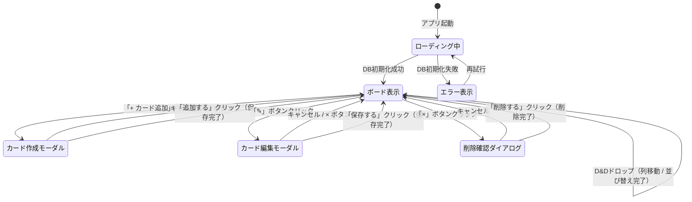

# 画面設計

---

## 1. ワイヤーフレーム

### メインボード

```
┌─────────────────────────────────────────────────────────────────┐
│              Trello風タスク管理アプリ                            │  ← タイトル
├───────────────────┬───────────────────┬────────────────────────┤
│    Todo (2)       │   進行中 (1)      │    完了 (1)            │  ← 列ヘッダー（カード数バッジ付き）
│ [並び替えなし ▾]  │ [並び替えなし ▾]  │ [並び替えなし ▾]       │  ← 列ごとの並び替えセレクト
├───────────────────┼───────────────────┼────────────────────────┤
│ ┌───────────────┐ │ ┌───────────────┐ │ ┌────────────────────┐ │
│ │[高]           │ │ │[低]            │ │ │[中]                │ │  ← 優先度バッジ
│ │タスクA        │ │ │タスクC        │ │ │タスクD             │ │  ← カード
│ │      [✎][ ][→][×]│ │      [✎][←][→][×]│ │      [✎][←][ ][×] │ │  ← 編集・移動・削除ボタン
│ │ 📅 2026/07/18  │ │ │ 📅 2026/07/30  │ │ │                    │ │  ← 期限日表示
│ │ 期限超過      │ │ │               │ │ │                    │ │  ← 期限超過バッジ
│ └───────────────┘ │ └───────────────┘ │ └────────────────────┘ │
│ ┌───────────────┐ │                   │                        │
│ │[中]           │ │                   │                        │
│ │タスクB        │ │                   │                        │
│ │      [✎][ ][→][×]│ │               │                        │
│ │ 📅 2026/07/20  │ │                   │                        │  ← もうすぐ期限
│ │ もうすぐ期限  │ │                   │                        │
│ └───────────────┘ │                   │                        │
│                   │                   │                        │
│ [+ カード追加]    │ [+ カード追加]    │ [+ カード追加]         │
└───────────────────┴───────────────────┴────────────────────────┘
```

> 「Todo」列の←ボタン、「完了」列の→ボタンはそれぞれ無効化されグレー表示になる。
> 並び替えセレクトの選択肢は「並び替えなし」「優先度順」「期限順」の3つ。列ごとに独立して保持され、表示順のみを変更する（保存されている `order` は変更しない）。

---

### ドラッグ中の状態

```
┌───────────────────┬───────────────────┬────────────────────────┐
│    Todo (2)       │   進行中 (1)      │    完了 (1)            │
│ ┌───────────────┐ │╔═══════════════╗  │                        │
│ │タスクA        │ │║ ドロップ受付中║  │                        │  ← ドロップ可能な列を点線枠でハイライト
│ │[✎][ ][→][×]  │ │╚═══════════════╝  │                        │
│ └───────────────┘ │                   │                        │
│ ┌ ─ ─ ─ ─ ─ ─ ┐ │ ─────────────────  │                        │  ← ドラッグ中カードは半透明
│  タスクB (移動中) │ ← 挿入位置インジケータ（青い水平線）         │
│ └ ─ ─ ─ ─ ─ ─ ┘ │                   │                        │
│ [+ カード追加]    │ [+ カード追加]    │ [+ カード追加]         │
└───────────────────┴───────────────────┴────────────────────────┘
```

---

### タスク作成/編集モーダル（カード追加・編集時に表示）

```
░░░░░░░░░░░░░░░░░░░░░░░░░░░░░░░░░░░░░░░░░░░░░  ← オーバーレイ（背景を暗転）
░░░ ┌─────────────────────────────────────┐ ░░░
░░░ │ カードを追加 / カードを編集       × │ ░░░  ← タイトル・閉じるボタン
░░░ ├─────────────────────────────────────┤ ░░░
░░░ │                                     │ ░░░
░░░ │ タスク名                            │ ░░░
░░░ │ ┌───────────────────────────────┐   │ ░░░
░░░ │ │ タスク名を入力...             │   │ ░░░  ← 入力欄（編集時は既存テキスト表示）
░░░ │ └───────────────────────────────┘   │ ░░░
░░░ │                                     │ ░░░
░░░ │ 優先度                              │ ░░░
░░░ │ ┌───────────────────────────────┐   │ ░░░
░░░ │ │ 中                          ▾ │   │ ░░░  ← 高／中／低から選択（初期値: 中）
░░░ │ └───────────────────────────────┘   │ ░░░
░░░ │                                     │ ░░░
░░░ │ 期限日（任意）                      │ ░░░
░░░ │ ┌───────────────────────────────┐   │ ░░░
░░░ │ │ 2026/07/31                    │   │ ░░░  ← 日付入力欄（空欄可）
░░░ │ └───────────────────────────────┘   │ ░░░
░░░ │ 設定しない場合は空欄のままにしてください │ ░░░  ← ヒントテキスト
░░░ │                                     │ ░░░
░░░ │    [キャンセル] [追加する/保存する]  │ ░░░  ← 作成時は「追加する」、編集時は「保存する」
░░░ │                                     │ ░░░
░░░ └─────────────────────────────────────┘ ░░░
░░░░░░░░░░░░░░░░░░░░░░░░░░░░░░░░░░░░░░░░░░░░░
```

---

### 削除確認ダイアログ（カード削除前に表示）

```
░░░░░░░░░░░░░░░░░░░░░░░░░░░░░░░░░░░░░░░░░░░░░
░░░ ┌─────────────────────────────────────┐ ░░░
░░░ │ カードを削除しますか？               │ ░░░  ← タイトル
░░░ ├─────────────────────────────────────┤ ░░░
░░░ │                                     │ ░░░
░░░ │  「タスクA」を削除します。          │ ░░░  ← 対象カード名を表示
░░░ │  この操作は元に戻せません。         │ ░░░  ← 注意書き
░░░ │                                     │ ░░░
░░░ │         [キャンセル]  [削除する]    │ ░░░  ← 削除ボタンは強調色（赤系）
░░░ │                                     │ ░░░
░░░ └─────────────────────────────────────┘ ░░░
░░░░░░░░░░░░░░░░░░░░░░░░░░░░░░░░░░░░░░░░░░░░░
```

---

## 2. 画面遷移図（UI状態遷移）


```mermaid
stateDiagram-v2
    [*] --> ローディング中 : アプリ起動

    ローディング中 --> ボード表示 : DB初期化成功
    ローディング中 --> エラー表示 : DB初期化失敗
    エラー表示 --> ローディング中 : 再試行

    ボード表示 --> カード作成モーダル : 「+ カード追加」クリック
    カード作成モーダル --> ボード表示 : キャンセル / × ボタン
    カード作成モーダル --> ボード表示 : 「追加する」クリック（保存完了）

    ボード表示 --> カード編集モーダル : 「✎」ボタンクリック
    カード編集モーダル --> ボード表示 : キャンセル / × ボタン
    カード編集モーダル --> ボード表示 : 「保存する」クリック（保存完了）

    ボード表示 --> 削除確認ダイアログ : 「×」ボタンクリック
    削除確認ダイアログ --> ボード表示 : キャンセル
    削除確認ダイアログ --> ボード表示 : 「削除する」クリック（削除完了）

    ボード表示 --> ボード表示 : D&Dドロップ（列移動 / 並び替え完了）
```

---

## 3. 画面要件

| 画面・状態 | 表示条件 | 主な要素 |
|-----------|---------|---------|
| ローディング中 | アプリ起動〜DB初期化完了まで | スピナー等のローディング表示 |
| ボード表示 | DB初期化成功後 | 3列リスト（列ごとに並び替えセレクト付き）、カード一覧（テキスト・優先度バッジ・期限日・操作ボタン）、「+ カード追加」ボタン |
| エラー表示 | DB初期化失敗時 | エラーメッセージ、再試行ボタン |
| カード作成モーダル | 「+ カード追加」クリック時 | テキスト入力欄、優先度セレクト（初期値: 中）、期限日入力欄（任意）、「追加する」「キャンセル」ボタン |
| カード編集モーダル | 「✎」ボタンクリック時 | 既存テキスト表示の入力欄、既存優先度のセレクト、既存期限日の入力欄、「保存する」「キャンセル」ボタン |
| 削除確認ダイアログ | 「×」ボタンクリック時 | カード名表示、「削除する」（赤系）「キャンセル」ボタン |

### カードのボタン構成

| ボタン | アイコン | 動作 |
|--------|---------|------|
| 編集ボタン | ✎（薄緑背景） | カード編集モーダルを開く |
| 左移動ボタン | ←（薄青背景） | 左隣の列へカードを移動（「Todo」列では無効化） |
| 右移動ボタン | →（薄青背景） | 右隣の列へカードを移動（「完了」列では無効化） |
| 削除ボタン | ×（薄赤背景） | 削除確認ダイアログを表示 |

### 期限日の色分けルール

| 期限状態 | 表示色 | バッジ |
|---------|--------|-------|
| 期限超過（今日より前） | 赤文字（`#c0392b`） | 「期限超過」（赤背景） |
| 当日・翌日 | オレンジ文字（`#d35400`） | 「もうすぐ期限」（薄オレンジ背景） |
| それ以外 | グレー文字（`#5e6c84`） | なし |
| 未設定 | 非表示 | — |

### 優先度バッジの色分けルール

| 優先度 | バッジ色 |
|--------|---------|
| 高 | 赤背景・赤文字（`#fce8e8` / `#c0392b`） |
| 中（初期値） | オレンジ背景・オレンジ文字（`#fef3e2` / `#d35400`） |
| 低 | 緑背景・緑文字（`#e3f9e5` / `#006644`） |

### 列ごとの並び替え

| 選択肢 | 動作 |
|--------|------|
| 並び替えなし（初期値） | 保存されている表示順序（`order`）のまま表示 |
| 優先度順 | 高 → 中 → 低の順に表示（保存順序は変更しない） |
| 期限順 | 期限日が近い順に表示。期限未設定のカードは末尾（保存順序は変更しない） |

### ドラッグ＆ドロップのビジュアルフィードバック

| 状態 | 表示 |
|------|------|
| ドラッグ中カード | opacity 0.4（半透明） |
| ドロップ可能な列 | 背景色変化 ＋ 点線アウトライン |
| 挿入位置 | 青い水平線（高さ 3px） |

### UI共通仕様

| 項目 | 内容 |
|------|------|
| 対応画面幅 | デスクトップのみ。最小幅 1024px 以上を対象とし、それ未満は動作保証外 |
| アクセシビリティ | ボタン要素には `aria-label` を付与する（最低限対応） |
| セキュリティ | XSSを防ぐため、カードテキストはHTML文字列としてではなくテキストノードとして描画する |
