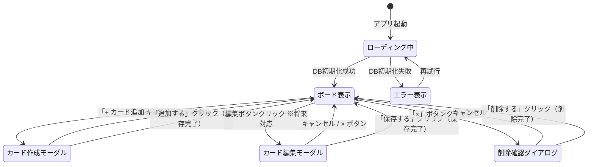

# Trello風タスク管理アプリ 要件定義書

---

## 改訂履歴

| バージョン | 日付 | 変更内容 |
|-----------|------|---------|
| 1.0 | 2026-05-18 | 初版作成 |
| 1.1 | 2026-05-24 | 用語定義・スコープ外・ユースケース・受け入れ条件・エラーハンドリング要件・スケジュール・テスト方針・保守運用要件を追加。非機能要件を具体化。E-R図を追加。 |
| 1.2 | 2026-05-24 | データ保存をlocalStorageからIndexedDB（Dexie.js）に変更。用語定義・非機能要件・エラーハンドリング・データ構造・E-R図・技術選定・テスト方針・保守運用要件を更新。DBスキーマ設計セクションを新設。 |

---

## 1. プロジェクト概要

| 項目 | 内容 |
|------|------|
| アプリ名 | Trello風タスク管理アプリ |
| 作成日 | 2026-05-18 |
| 目的 | タスクをカード形式で管理し、進捗を視覚的に把握する |
| 対象ユーザー | 個人（1人利用） |

---

## 2. 目的・背景

タスクをTrelloのようにカード形式で管理し、「Todo / 進行中 / 完了」の3列で進捗を視覚的に把握できる個人用タスク管理アプリを作成する。

---

## 3. 用語定義

| 用語 | 定義 |
|------|------|
| ボード | アプリ全体の作業スペース。3つのリストを横並びに表示する画面 |
| リスト（列） | 「Todo」「進行中」「完了」の各カラム。カードを縦方向に並べて管理する単位 |
| カード | 1件のタスクを表す最小単位。タスク名（テキスト）と表示順序（order）を持つ |
| カード追加 | テキスト入力欄にタスク名を入力し、リストに新しいカードを登録する操作 |
| カード削除 | カードの「×」ボタンを押してカードをリストから取り除く操作 |
| カード移動 | カードを現在のリストから隣のリストへ移す操作（Todo → 進行中 → 完了 の順） |
| IndexedDB | ブラウザに標準搭載された構造化データベース。キーと値のペアをオブジェクトストア単位で管理する |
| Dexie.js | IndexedDB のラッパーライブラリ。Promise ベースの簡潔な API を提供し、スキーマ定義とマイグレーション管理を容易にする |
| オブジェクトストア | IndexedDB におけるテーブルに相当するデータ格納単位 |
| トランザクション | 複数のDB操作をひとまとまりとして扱う仕組み。全て成功するか、失敗時は全てロールバックされることを保証する |
| スキーマ | DBのデータ構造定義（オブジェクトストア・インデックス等） |
| スキーママイグレーション | DBのスキーマを変更する際の移行手順。Dexie.js ではバージョン番号で管理する |
| インデックス | 特定フィールドでの検索を高速化するためにDBが作成する索引 |
| 非同期処理 | DBへの読み書きはPromise / async-await で処理され、UIの描画をブロックしない方式 |
| 初期状態 | アプリを初めて起動した時、またはデータをリセットした時の3列が空の状態 |

---

## 4. スコープ外

以下は本プロジェクトのスコープ外とし、対応しない。

| # | 項目 | 理由 |
|---|------|------|
| 1 | ユーザー認証・ログイン機能 | 個人利用のため不要 |
| 2 | 複数デバイス間のデータ同期 | サーバーレス構成のため対象外 |
| 3 | 通知・リマインダー機能 | 初回リリーススコープ外 |
| 4 | カード間の依存関係・優先度管理 | 初回リリーススコープ外 |
| 5 | レスポンシブ対応（スマートフォン・タブレット） | デスクトップのみを対象とする |
| 6 | 複数ボードの管理 | 1ボード固定 |
| 7 | チーム・複数人での同時利用 | 個人利用のみ |
| 8 | データのエクスポート・インポート | 将来対応で検討 |
| 9 | 自動テスト（Jest等） | 初回リリーススコープ外、フェーズ2以降で検討 |
| 10 | サーバーサイドDB（MySQL・PostgreSQL等） | ブラウザ完結構成のため対象外 |

---

## 5. 機能要件

### 5-1. 必須機能（初回リリース対象）

| # | 機能名 | 説明 |
|---|--------|------|
| 1 | リスト表示 | Todo / 進行中 / 完了 の3列を画面に表示する |
| 2 | カード追加 | 各列にテキスト入力でタスク（カード）を追加できる |
| 3 | カード削除 | カードの削除ボタン（×）を押すと該当カードを削除できる |
| 4 | カード移動 | カードに付いたボタンで別の列へ移動できる |
| 5 | データ保存 | ページを閉じてもデータが消えないよう、IndexedDB にブラウザ内で自動保存する |

### 5-2. 将来対応機能（初回リリース対象外）

| # | 機能名 | 説明 |
|---|--------|------|
| 1 | カード編集 | 追加済みカードのテキストを後から変更できる |
| 2 | 期限設定 | カードに締め切り日を設定・表示できる |
| 3 | ドラッグ＆ドロップ移動 | カードをドラッグして別の列に移動できる |

---

## 6. 非機能要件

| 項目 | 内容 |
|------|------|
| 対応ブラウザ | Chrome 120以上 / Firefox 120以上 / Safari 17以上（各最新安定版）。いずれも IndexedDB をサポートしていること |
| 表示速度 | 初期表示（DB読み込み含む）は3秒以内（ローカル環境）。カード操作（追加・削除・移動）のUI反映は100ms以内 |
| DB非同期処理 | IndexedDB への読み書きはすべて非同期（async/await）で行い、UI描画をブロックしない。ローディング中はスピナー等でユーザーに状態を伝える |
| データ容量 | IndexedDB の上限はブラウザにより異なるが、概ねディスク空き容量の50%程度。本アプリの用途（テキストのみのカード管理）では容量上限に達することは想定しない |
| データ共有 | 不要（個人利用のみ。同一ブラウザ・同一デバイスでのみデータが保持される） |
| サーバー | 不要（ブラウザのみで動作。外部通信なし） |
| 対応画面幅 | デスクトップのみ。最小幅 1024px 以上を対象とし、それ未満は動作保証外 |
| アクセシビリティ | ボタン要素には `aria-label` を付与する（最低限対応） |
| セキュリティ | XSSを防ぐため、カードテキストはHTML文字列としてではなくテキストノードとして描画する |

---

## 7. ユースケース

### UC-01: カードを追加する

| 項目 | 内容 |
|------|------|
| アクター | ユーザー |
| 事前条件 | アプリが起動しており、DBの初期化が完了し、3列のリストが表示されている |
| 事後条件 | 新しいカードが該当リストの末尾に表示され、IndexedDB に保存されている |

**基本フロー:**
1. ユーザーが追加したいリストの「+ カード追加」ボタンを押す
2. テキスト入力欄が表示される
3. ユーザーがタスク名を入力する
4. ユーザーが「追加」ボタンを押す（またはEnterキーを押す）
5. アプリが IndexedDB にカードを書き込む（非同期）
6. 書き込み完了後、入力したテキストのカードがリストの末尾に追加される
7. テキスト入力欄がクリアされる

**代替フロー:**
- 3a. テキストが空（スペースのみ含む）のまま「追加」を押した場合 → カードは追加されず、入力欄にフォーカスが当たる
- 5a. DB書き込みに失敗した場合 → エラーメッセージを表示し、UI上のカード追加を行わない

---

### UC-02: カードを削除する

| 項目 | 内容 |
|------|------|
| アクター | ユーザー |
| 事前条件 | 少なくとも1枚のカードがいずれかのリストに存在する |
| 事後条件 | 対象カードが画面から消え、IndexedDB のデータが更新されている |

**基本フロー:**
1. ユーザーが削除したいカードの「×」ボタンを押す
2. アプリが IndexedDB からカードレコードを削除する（非同期）
3. 削除完了後、該当カードがリストから取り除かれる

**代替フロー:**
- 2a. DB削除に失敗した場合 → エラーメッセージを表示し、UI上の表示は変更しない

---

### UC-03: カードを別のリストへ移動する

| 項目 | 内容 |
|------|------|
| アクター | ユーザー |
| 事前条件 | 少なくとも1枚のカードが存在する |
| 事後条件 | カードが移動先のリストに表示され、IndexedDB の `column_id` が更新されている |

**基本フロー:**
1. ユーザーがカードの移動ボタン（→）を押す
2. アプリがトランザクション内でカードの `column_id` と `order` を更新する（非同期）
3. 更新完了後、カードが移動先のリストに表示される

**代替フロー:**
- 2a. 「完了」列のカードに対して移動ボタンを押した場合 → 「Todo」列へ戻る（またはボタンを非表示にする）
- 2b. DBトランザクションに失敗した場合 → ロールバックされ、エラーメッセージを表示する

---

### UC-04: ブラウザ再起動後もデータを保持する

| 項目 | 内容 |
|------|------|
| アクター | ユーザー（ブラウザ） |
| 事前条件 | カードがいずれかのリストに1枚以上存在する |
| 事後条件 | 再起動前と同じカード配置が復元されている |

**基本フロー:**
1. ユーザーがブラウザのタブを閉じる（またはページを更新する）
2. ユーザーが再度アプリを開く
3. アプリが IndexedDB からカラムとカードを読み込む（非同期）
4. ローディング完了後、閉じる前の状態（カードの内容・列の配置・順序）がそのまま表示される

---

## 8. 受け入れ条件

| # | 機能 | 受け入れ条件 |
|---|------|-------------|
| AC-01 | リスト表示 | アプリ起動時に「Todo」「進行中」「完了」の3列が横並びで表示されること |
| AC-02 | DB初期化 | アプリ起動時にIndexedDBの初期化が完了してからカードが表示されること（ローディング状態が適切に表現されること） |
| AC-03 | カード追加 | テキストを入力して追加操作を行うと、該当リストの末尾にカードが追加され、IndexedDBに保存されること |
| AC-04 | 空入力ガード | テキストが空（スペースのみを含む）の場合、カードが追加されないこと |
| AC-05 | カード削除 | 「×」ボタンを押すと対象カードのみが削除され、他のカードに影響しないこと |
| AC-06 | カード移動 | 移動ボタンを押すと、カードが次の列へ移動すること（Todo → 進行中 → 完了 の順）。DBの `column_id` が更新されていること |
| AC-07 | データ保存 | ページリロード後も追加・削除・移動の結果がIndexedDBから正しく復元されること |
| AC-08 | DB初期化失敗 | IndexedDB が利用不可の場合、エラーメッセージが表示されアプリが強制終了しないこと |
| AC-09 | トランザクション失敗 | DB書き込みが失敗した場合、UIの状態が変更されずエラーメッセージが表示されること |

---

## 9. エラーハンドリング要件

| # | エラー条件 | 対応方法 |
|---|-----------|---------|
| E-01 | IndexedDB が使用不可（非対応ブラウザ・プライベートブラウジング等） | 画面上部に「データベースを初期化できません。ブラウザの設定または対応状況を確認してください。」と表示。アプリ自体はメモリ上で動作継続（保存なしモード） |
| E-02 | DBトランザクション失敗（書き込み・削除・更新エラー） | 操作をロールバックし、UI状態を変更しない。「操作に失敗しました。再試行してください。」とユーザーに通知する |
| E-03 | スキーママイグレーション失敗（バージョンアップ時） | DBを初期化し、空のボード状態から起動。「データベースの更新に失敗したためリセットされました。」とユーザーに通知する |
| E-04 | ストレージ容量超過（QuotaExceededError） | 「ストレージの空き容量が不足しています。不要なデータを削除してください。」と表示し、操作を中止する |
| E-05 | 空テキストのカード追加操作 | カードを追加せず、入力欄にフォーカスを当てる。エラーメッセージは表示しない（操作の流れを妨げないよう） |
| E-06 | 予期しない JavaScript エラー | コンソールにエラーを出力する。可能な範囲でアプリの動作を継続し、画面が真っ白になることを避ける |

---

## 10. 画面設計

### 10-1. ワイヤーフレーム

```
┌─────────────────────────────────────────────┐
│         Trello風タスク管理アプリ              │  ← タイトル
├──────────────┬──────────────┬───────────────┤
│    Todo      │   進行中     │    完了        │  ← 列ヘッダー
│  (2枚)       │  (1枚)       │   (1枚)        │  ← カード枚数
├──────────────┼──────────────┼───────────────┤
│ ┌──────────┐ │ ┌──────────┐ │ ┌───────────┐ │
│ │タスクA   │ │ │タスクC   │ │ │タスクD    │ │  ← カード
│ │   [→][×] │ │ │   [→][×] │ │ │   [→][×] │ │  ← 移動・削除ボタン
│ └──────────┘ │ └──────────┘ │ └───────────┘ │
│ ┌──────────┐ │              │               │
│ │タスクB   │ │              │               │
│ │   [→][×] │ │              │               │
│ └──────────┘ │              │               │
│              │              │               │
│ [+ カード追加]│[+ カード追加]│[+ カード追加] │  ← 追加ボタン
└──────────────┴──────────────┴───────────────┘
```

**タスク作成/編集モーダル（カード追加・編集時に表示）:**

```
░░░░░░░░░░░░░░░░░░░░░░░░░░░░░░░░░░░░░░░░░░░░░  ← オーバーレイ（背景を暗転）
░░░ ┌─────────────────────────────────────┐ ░░░
░░░ │ カードを追加 / カードを編集       × │ ░░░  ← タイトル・閉じるボタン
░░░ ├─────────────────────────────────────┤ ░░░
░░░ │                                     │ ░░░
░░░ │ タスク名                            │ ░░░
░░░ │ ┌───────────────────────────────┐   │ ░░░
░░░ │ │ タスク名を入力...             │   │ ░░░  ← 入力欄（編集時は既存テキスト表示）
░░░ │ └───────────────────────────────┘   │ ░░░
░░░ │                                     │ ░░░
░░░ │       [キャンセル] [追加する/保存する] │ ░░░  ← 作成時は「追加する」、編集時は「保存する」
░░░ │                                     │ ░░░
░░░ └─────────────────────────────────────┘ ░░░
░░░░░░░░░░░░░░░░░░░░░░░░░░░░░░░░░░░░░░░░░░░░░
```

**削除確認ダイアログ（カード削除前に表示）:**

```
░░░░░░░░░░░░░░░░░░░░░░░░░░░░░░░░░░░░░░░░░░░░░
░░░ ┌─────────────────────────────────────┐ ░░░
░░░ │ カードを削除しますか？               │ ░░░  ← タイトル
░░░ ├─────────────────────────────────────┤ ░░░
░░░ │                                     │ ░░░
░░░ │  「タスクA」を削除します。          │ ░░░  ← 対象カード名を表示
░░░ │  この操作は元に戻せません。         │ ░░░  ← 注意書き
░░░ │                                     │ ░░░
░░░ │         [キャンセル]  [削除する]    │ ░░░  ← 削除ボタンは強調色（赤系）
░░░ │                                     │ ░░░
░░░ └─────────────────────────────────────┘ ░░░
░░░░░░░░░░░░░░░░░░░░░░░░░░░░░░░░░░░░░░░░░░░░░
```

---

### 10-2. 画面遷移図（UI状態遷移）



> ※ カード編集モーダルへの遷移は将来対応機能（5-2 参照）のため、初回リリースでは実装しない。

---

### 10-3. E-R図

```
┌────────────────────────────┐            ┌──────────────────────────────┐
│           Column            │            │             Card              │
│────────────────────────────│            │──────────────────────────────│
│ PK  id        : string     │  1      *  │ PK  id        : string       │
│     title     : string     │────────────│ FK  column_id : string       │
│     order     : number     │            │     text      : string       │
└────────────────────────────┘            │     order     : number       │
                                          └──────────────────────────────┘
```

**関係の説明:**

| エンティティ | 属性 | 説明 |
|------------|------|------|
| Column（リスト） | id, title, order | 「Todo」「進行中」「完了」の3つが固定で存在する。`order` は列の表示順序 |
| Card（カード） | id, column_id, text, order | 1件のタスク。必ずいずれか1つの Column に属する。`order` はリスト内での表示順序 |

- Column : Card = 1 : 多（1つのリストは0件以上のカードを持つ）
- Card は必ず1つの Column に属する（どのリストにも属さないカードは存在しない）
- データは IndexedDB の2つのオブジェクトストア（`columns` / `cards`）に正規化して保存する

---

## 11. 技術選定

| 項目 | 選択 | 理由 |
|------|------|------|
| 言語 | JavaScript | Web標準言語 |
| フレームワーク | React | UIを部品単位で管理しやすい。非同期状態管理との相性が良い |
| ブラウザDB | IndexedDB（Dexie.js） | サーバー不要でブラウザ内にデータを永続化できる。Dexie.js により Promise ベースの簡潔な API を利用でき、スキーマ管理・マイグレーションも容易 |
| スタイル | CSS | シンプルに見た目を整える |

---

## 12. データ構造

### 12-1. オブジェクトストア定義

IndexedDB 内に以下の2つのオブジェクトストアを持つ。

**columns ストア**

| フィールド | 型 | 制約 | 説明 |
|-----------|-----|------|------|
| id | string | PK | 列の一意識別子（例: `"todo"`, `"in-progress"`, `"done"`） |
| title | string | NOT NULL | 列のヘッダー名（例: `"Todo"`） |
| order | number | INDEX | 列の表示順序（0始まり） |

**cards ストア**

| フィールド | 型 | 制約 | 説明 |
|-----------|-----|------|------|
| id | string | PK | カードの一意識別子（例: `"card-1"`） |
| column_id | string | FK / INDEX | 所属する列の id |
| text | string | NOT NULL | タスク名 |
| order | number | INDEX | 列内での表示順序（0始まり） |

---

### 12-2. データ例

**columns ストア**
```json
[
  { "id": "todo",        "title": "Todo",  "order": 0 },
  { "id": "in-progress", "title": "進行中", "order": 1 },
  { "id": "done",        "title": "完了",  "order": 2 }
]
```

**cards ストア**
```json
[
  { "id": "card-1", "column_id": "todo",        "text": "タスクA", "order": 0 },
  { "id": "card-2", "column_id": "todo",        "text": "タスクB", "order": 1 },
  { "id": "card-3", "column_id": "in-progress", "text": "タスクC", "order": 0 },
  { "id": "card-4", "column_id": "done",        "text": "タスクD", "order": 0 }
]
```

---

## 13. DBスキーマ設計

### 13-1. DB基本情報

| 項目 | 内容 |
|------|------|
| DB名 | `TaskManagerDB` |
| 初期バージョン | 1 |
| 使用ライブラリ | Dexie.js |

### 13-2. Dexie.js スキーマ定義

```javascript
import Dexie from 'dexie';

const db = new Dexie('TaskManagerDB');

db.version(1).stores({
  columns: 'id, order',            // PK: id、インデックス: order
  cards:   'id, column_id, order'  // PK: id、インデックス: column_id, order
});

export default db;
```

### 13-3. 主要クエリパターン

| 操作 | クエリ例 |
|------|---------|
| 全列を順番に取得 | `db.columns.orderBy('order').toArray()` |
| 列に属するカードを順番に取得 | `db.cards.where('column_id').equals(columnId).sortBy('order')` |
| カードを追加 | `db.cards.add({ id, column_id, text, order })` |
| カードを削除 | `db.cards.delete(cardId)` |
| カードを別列へ移動（トランザクション） | `db.transaction('rw', db.cards, () => db.cards.update(cardId, { column_id, order }))` |

### 13-4. マイグレーション方針

- スキーマ変更時は `db.version(N).stores({...}).upgrade(tx => {...})` を追記し、バージョン番号をインクリメントする
- 旧バージョンのコードは削除せず履歴として残す
- 本要件定義書の改訂履歴にバージョンアップ内容を記録する

---

## 14. スケジュール・マイルストーン

| フェーズ | マイルストーン | 目標日 |
|---------|-------------|--------|
| フェーズ1-1 | プロジェクト作成（create-react-app）・Dexie.js 導入・画面レイアウト実装 | 2026-05-31 |
| フェーズ1-2 | IndexedDB スキーマ定義・初期データ投入・DB読み込み実装 | 2026-06-07 |
| フェーズ1-3 | カード追加・削除・移動（IndexedDB連携）実装 | 2026-06-07 |
| フェーズ1-4 | エラーハンドリング・ローディング状態実装 | 2026-06-11 |
| フェーズ1-5 | 手動テスト・バグ修正・初回リリース | 2026-06-14 |
| フェーズ2 | カード編集・期限設定・ドラッグ＆ドロップ（将来） | 未定 |

---

## 15. テスト方針

### テストの種類

| テスト種別 | 内容 | タイミング |
|-----------|------|-----------|
| 単機能テスト | 各機能（追加・削除・移動・DB保存）を単独で受け入れ条件に基づき確認 | 各機能の実装完了後 |
| 結合テスト | 複数機能を組み合わせた操作シナリオ（UC-01〜UC-04）を通して確認 | フェーズ1-5 |
| ブラウザ互換テスト | Chrome / Firefox / Safari で IndexedDB を含む主要操作を確認 | フェーズ1-5 |
| DB エラー系テスト | プライベートブラウジング等でIndexedDBが利用不可の状態での動作確認（E-01） | フェーズ1-5 |
| マイグレーションテスト | スキーマバージョンアップ後に旧データが正しく移行されることを確認 | スキーマ変更時 |

### テスト実施方針

- テストは手動で実施する（自動テストは初回リリーススコープ外）
- 受け入れ条件（AC-01〜AC-09）をチェックリストとして使用し、全項目の合格をリリース条件とする
- DB の状態確認には Chrome DevTools の「Application → IndexedDB」を使用する
- 発見したバグはメモ等に記録し、リリース前に解消する
- 自動テスト（Jest・React Testing Library等）はフェーズ2以降で導入を検討する

---

## 16. 保守・運用要件

| 項目 | 内容 |
|------|------|
| バグ対応 | 発見次第、随時修正する（個人利用のためSLAは設定しない） |
| データバックアップ | IndexedDB のデータはブラウザのデータ消去で失われる。定期的なエクスポート機能（JSON形式）をフェーズ2以降で検討する |
| DBスキーマ変更 | スキーマ変更時は必ず `db.version(N).upgrade()` でマイグレーションを実装し、既存データを破棄しない。バージョン番号は本要件定義書の改訂履歴と合わせて管理する |
| バージョン管理 | Git（GitHub）で管理。mainブランチを安定版とする |
| 依存ライブラリ更新 | 重大な脆弱性が報告された場合は随時対応する。定期更新は月1回程度を目安とする |
| 機能追加方針 | フェーズ2以降の機能追加は本要件定義書の「将来対応機能」に従い、都度要件を追記・改訂する |

---

## 17. 開発スコープ

```
フェーズ1（今回作成）
  ├── プロジェクト作成（create-react-app）
  ├── Dexie.js 導入・DBスキーマ定義
  ├── 画面レイアウト実装
  ├── カード追加・削除・移動（IndexedDB連携）
  └── エラーハンドリング・ローディング状態実装

フェーズ2（将来）
  ├── カード編集
  ├── 期限設定
  ├── ドラッグ＆ドロップ
  └── データエクスポート（JSON形式）
```
